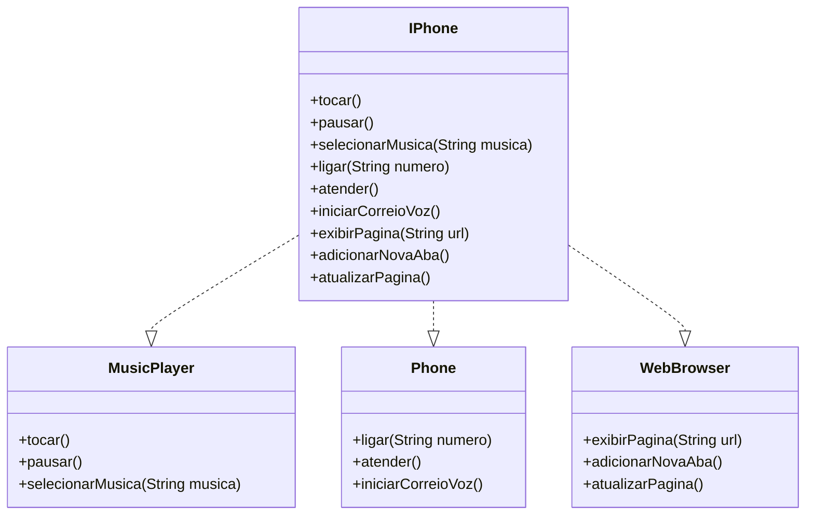

```mermaid
classDiagram
class IPhone {
+tocar()
+pausar()
+selecionarMusica(String musica)
+ligar(String numero)
+atender()
+iniciarCorreioVoz()
+exibirPagina(String url)
+adicionarNovaAba()
+atualizarPagina()
}
class MusicPlayer {
+tocar()
+pausar()
+selecionarMusica(String musica)
}
class Phone {
+ligar(String numero)
+atender()
+iniciarCorreioVoz()
}
class WebBrowser {
+exibirPagina(String url)
+adicionarNovaAba()
+atualizarPagina()
}
IPhone ..|> MusicPlayer
IPhone ..|> Phone
IPhone ..|> WebBrowser
```